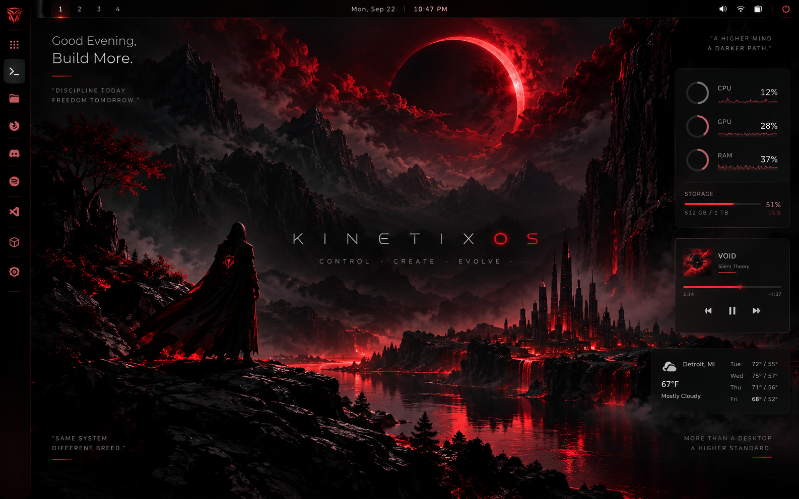

# 02 — Design System

KinetixOS desktop design follows the supplied `kinetixOS.png` reference. This file is the contract between that visual direction and the QML tokens in `shell/common/Theme.qml`.

## KinetixOS visual north star

This image is the authoritative guide for the complete desktop environment—not only its wallpaper. It defines the KinetixOS identity, atmosphere, visual hierarchy, and placement of shell surfaces. Where older Argus-era guidance below conflicts with the image, this section wins; update the conflicting token/component guidance before using it for new design work.

Translate the reference into the responsive Quickshell desktop:

- **Atmosphere:** cinematic near-black landscape, restrained detail, and generous quiet space around the central KINETIX identity.
- **Brand:** KINETIX/KinetixOS wordmark and crimson-red light are the primary identity. Do not reintroduce violet/teal as the desktop's competing brand palette.
- **Composition:** preserve the slim top status/workspace bar; a full-width, bottom-docked taskbar (`shell/taskbar/`, the conventional Windows/Cinnamon/KDE shape) provides the application-launcher button and live window management; keep an open central wallpaper/wordmark field and subtle corner taglines. Do not show desktop widgets by default. The existing widget framework is opt-in only.
- **Materials:** dark glass, subtle keylines, soft red illumination, and high-contrast white/gray type. Red is a deliberate signal, not a wash applied to every surface.
- **Responsive behavior:** preserve the same hierarchy at different resolutions and scale factors; reflow or hide secondary cards on constrained screens instead of shrinking the whole mockup or covering the central workspace.
- **Meaning and accessibility:** preserve readable contrast and distinguish meaningful states (idle, active, warning, blocked). Semantic colors may supplement the red identity when needed for clarity, but must remain restrained and consistent.

The screenshot is a visual north star, not a fixed-pixel template: use its composition and hierarchy while keeping live content, accessibility, multi-monitor layouts, and user settings functional.

### Protected Kinetix Quickshell bar

The existing bar in `shell/bar/Bar.qml` and its supporting components is the canonical, primary KinetixOS bar. Keep it as the main bar and preserve its app launcher, Ghostty quick terminal, workspaces, telemetry popup, tray/media controls, agent surface, and App Center actions. User-authorized visual refinement may simplify surfaces and adapt presentation to screen width, but must not remove controls, their state/data bindings, or popup access. Do not replace the bar or let other desktop surfaces cover its hit targets; verify each preserved action after a visual pass.

## Color

Near-black canvas, white typography, **crimson red** as the primary brand accent.

| Token | Value | Use |
|---|---|---|
| `bg` | `#0B0D12` | desktop void behind glass |
| `surfaceLow` | `white @ 4%` | inset areas, wells |
| `surface` | `white @ 7%` | panels, bar |
| `surfaceHigh` | `white @ 11%` | hovered/raised |
| `stroke` | `white @ 10%` | hairline borders |
| `strokeStrong` | `white @ 18%` | focused borders |
| `text` | `white @ 92%` | primary |
| `textDim` | `white @ 60%` | secondary |
| `textFaint` | `white @ 38%` | captions, timestamps |
| `accent` | `#E01A3C` | Kinetix crimson — primary brand identity and active surfaces |
| `accent2` | `#FF4D6D` | lifted crimson — high-contrast brand text and glyphs |
| `warn` | `#FFB454` | needs-attention |
| `danger` | `#FF6B6B` | destructive, panic |

Signature treatment: crimson illumination against near-black, used sparingly
for Kinetix identity and active-agent presence (EdgeGlow, StatusOrb ring,
active workspace marker). Keep text readable and avoid a competing violet/teal
brand gradient; restraint is what makes the red feel intentional.

### Agent Panel palette

The Agent Panel shares the Kinetix crimson identity with the rest of the
desktop. Its deeper crimson, ember, amber, and alarm tokens distinguish
interaction and safety states—not a separate brand or visual room. The
restraint rule applies throughout: one coherent crimson-led family, with
semantic colors only where they communicate meaning.

| Token | Value | Use |
|---|---|---|
| `pAccent` | `#E01A3C` | vibrant crimson — borders, focus, bars, hovers, identity |
| `pAccentText` | `#FF4D6D` | radiant crimson lifted for text/glyphs (≥4.5:1 on both washes) |
| `pAccent2` | `#FF7324` | ember — glow, live pulses, "ok" |
| `pWarn` | `#C98F2E` | gilded amber — caution, reasoning (yellow-shifted so it can't be mistaken for ember at pip size) |
| `pDanger` | `#FF2E43` | alarm — blocked/error |
| `pGlowDeep` | `#3D0711` | deepest gradient/shadow stop |
| `pWell` | `#1C0A0E` | warm-dark inset fill — plan cards, idle pills |
| `pAct` | `#E03222` | hot vermilion — "act" step in the perceive→verify feed |
| `pVerify` | `#D46033` | rust — "verify" step (4.6:1 on panel base) |

Rules:

- `pAccent` (3.1:1 on the panel base) is for borders, bars and icons only.
  Anything textual — labels, glyphs, status text — uses `pAccentText`.
- `pWarn` and `pAccent2` sit 15° apart in hue (38° vs 23°); warn is also
  less saturated. Never move one toward the other.
- Panels of the same family should use the shared Kinetix crimson tokens
  (`Theme.crimson`/`Theme.crimsonText`) rather than inventing a new brand hue.
- Cross-surface semantic agent states stay consistent: idle/ok is subdued
  neutral, working is crimson, awaiting approval is amber, and blocked/error
  is alarm red. Use labels/icons as well as color so states remain legible.
  Panel-specific ember/verify shades may distinguish action-feed categories,
  but do not create a second brand palette.

### Main bar palette

The main bar's own chrome — its glass, hairlines and pill capsules, not the
semantic content drawn on top of it — is the same deep ominous crimson
family, via dedicated `bar*` tokens in `Theme.qml` rather than reusing
`glassBase`/`surfaceHigh` directly (so every other panel — overlays,
widgets, the launcher — keeps the neutral glass above unaffected by a future
bar-only tweak):

| Token | Value | Use |
|---|---|---|
| `barBase` | translucent dark oxblood, 74% (`Qt.rgba(0.065, 0.010, 0.018, 0.74)`) | the bar's own glassmorphic base slab — frosted by KWin desktop blur |
| `barBaseHigh` | elevated translucent wine-oxblood, 62% (`Qt.rgba(0.135, 0.020, 0.035, 0.62)`) | resting pill-capsule base — lifted off the bar as sculpted optical crystal lenses |
| `barHoverGlow` | crimson @ 28% | hovered (non-active) pill wash |
| `barStroke` | crimson @ 38% | inner keyline, resting pill hairline |
| `barStrokeStrong` | alarm @ 60% | active/hovered focus border |

The bar elevates the glassmorphic identity into a high-fidelity physical optical system:
- **Translucency & Frosted Substrate**: 74% oxblood base allows desktop wallpaper and background windows to diffuse through via KWin compositor blur.
- **Volumetric Optical Meniscus**: 5px sub-surface top shadow creating authentic glass bevel thickness.
- **Prismatic Directional Bevels**: Continuous 1px perimeter gradient frames around capsules catching overhead grazing light (`Qt.rgba(1, 1, 1, 0.32–0.55)`) on top and crimson laser reflection on bottom.
- **Convex Cylindrical Lens Dome Highlights**: Upper 48% vertical gradient highlight simulating 3D optical lens dome curvature.
- **Micro-Chamfers & Specular Crests**: 7-stop overhead Fresnel hairline on the bar and 6-stop diamond-bright center crests on capsules.

### App Center palette

The App Center popup inherits the same crimson treatment — it is package
management authority, the same room as the agent panel:

- Base `#0F0709`, warm maroon cards (`Qt.rgba(0.09, 0.043, 0.05, 0.75)`),
  and a static crimson identity keyline under the header. Update counts may
  animate only when package state changes; idle chrome stays quiet.
- Source coding, all in-family: All = `crimsonText`, AUR = `alarm`,
  Arch = `ember`, Flathub = `gilded`. Engine badges reuse their source's
  color (paru/yay → `alarm`, pacman → `ember`, flatpak → `gilded`).
- Update-pending = `gilded`, up-to-date/installed = `ember`,
  destructive hover = `alarm`, selection/focus = `crimson` (borders) and
  `crimsonText` (small text).

Glass: panels are translucent surfaces + 1px stroke + faint top highlight.
On KWin, enable the Blur desktop effect for true frosted glass; the tokens
are chosen so panels still read well unblurred.

## Typography

- UI: **Inter** (`inter-font`)
- Data/mono: **JetBrains Mono** (`ttf-jetbrains-mono`)

| Token | Size | Weight | Use |
|---|---|---|---|
| `tCaption` | 10 | medium | timestamps, microcopy |
| `tBody` | 12 | regular | default UI text |
| `tLabel` | 12 | semibold | section labels, buttons |
| `tTitle` | 14 | semibold | panel titles |
| `tDisplay` | 18 | medium | clock, hero numbers |

Tracking: +2% on all-caps Kinetix microcopy (`KINETIX`, status labels). Never letter-
space body text.

## Shape & space

- Radii: `rS 8 · rM 14 · rL 20 · rPill 999`
- Spacing: `s1 4 · s2 8 · s3 12 · s4 16 · s5 24 · s6 32`
- Bars/panels float — `margins: 10–14` from screen edges. Nothing touches
  the bezel.
- Hairlines over shadows: depth comes from translucency + stroke, not blur
  shadows.

## Motion

| Token | ms | Feel |
|---|---|---|
| `durFast` | 130 | hover, press |
| `durMed` | 240 | toggles, small reveals |
| `durSlow` | 420 | panel slides, overlay fades |
| `durAmbient` | 1600 | breathing loops (EdgeGlow, orb) |

- Ease out for entrances: `OutQuint`. Symmetric `InOutSine` for loops.
- Panel slides use `durSlow + OutQuint` — fast enough to feel instant,
  smooth enough to feel expensive.
- Ambient motion (EdgeGlow breath, orb pulse) runs at 1.2–1.6s periods —
  slow enough to read as "alive," not "alarming."
- Nothing bounces except intentional moments. `OutBack` is a garnish, not
  a staple.

## Fidelity v2 — the glass recipe

Every surface is built from `components/GlassPanel.qml`, which layers six
things. Skipping any of them is what makes QML shells look cheap:

1. **Soft multi-layer shadow** — 2–3 stacked rounded rects, each offset
   downward with decreasing alpha and increasing outward growth
   (`Theme.shadowFor(level)`). No hard single shadow.
2. **Tinted base** — `glassBase` at ~74% alpha over whatever is behind.
3. **Depth wash** — vertical gradient, light top → dark bottom. Reads as
   thickness.
4. **Specular sheen** — diagonal horizontal gradient (white 7.5% at the
   left edge, fading by 42%). Simulates a light source at upper-left.
5. **Rim light** — 1px top edge gradient (brightest ~16% in from the left,
   fading to nothing). This is the single highest-value detail.
6. **Accent glow** — 2px outer border at 20% accent when `tinted: true`
   (active/focused states).

### Elevation

| Level | Use | Shadow reach |
|---|---|---|
| 0 | insets, chips, wells | ~2px |
| 1 | default cards, toasts | ~10px |
| 2 | the bar, widgets | ~18px |
| 3 | floating panels, launcher, palette, OSD | ~30px |

### Blur

Real backdrop blur is compositor-side on Wayland. On KWin, enable the
**Blur** desktop effect — translucent layer surfaces get frosted. The tokens
are tuned so panels still read as premium glass without it. `QtQuick.Effects`
(`MultiEffect`) is available for in-shell blur/colorization where a surface
needs to blur its own content.

### Bar capsule treatment (`BarBox.qml`)

The bar uses the shared GlassPanel material for its base, stroke, and surface wash. Capsules add only a restrained hover wash, a low-key pressed response, and a crimson active state; avoid stacking separate bloom, bevel, and border layers. On narrow screens, compact telemetry and media metadata rather than shrinking type or letting the centered clock/search island overlap the side groups. The detailed telemetry popup and all control actions remain available.

### Taskbar (`shell/taskbar/`)

A full-width, bottom-docked bar (`Taskbar.qml`) — the conventional
Windows/Cinnamon/KDE shape: flush rectangular (`radius: 0`), anchored
`left/right/bottom`, `exclusiveZone: 56` so it reserves real screen space
(windows tile above it, never behind it) rather than floating over
content. Height matches the main bar (56px) for top/bottom symmetry.

- **Launcher button** at the far left opens the same application drawer
  every other surface opens (`AgentState.toggleLauncher()`) — one
  launcher, not a second competing one.
- **Live task buttons** (`TaskButton.qml`) sit in a horizontal, scrollable
  row and group multiple windows of the same app under one icon;
  left-click focuses/toggles-minimize, a grouped click cycles between
  windows, middle-click closes, right-click opens a per-window menu
  (focus/minimize/close, individual per-window close) via
  `TaskPreview.qml`/the window-menu popup, both of which open **upward**
  above the bar. Hovering opens a live preview card after a short delay.
  The active app is marked with a bottom-edge underline (the
  Windows/ChromeOS convention for a horizontal bar), not a left-edge bar.
- **Show-desktop** button at the far right minimizes/restores every
  window at once.
- Icon and display-name resolution goes through `TaskStore.qml`, which
  reuses `AppIndex` (the same desktop-file index the launcher already
  uses) rather than inventing a second one.
- Crimson/oxblood throughout (`GlassPanel`, `Theme.crimson`/`crimsonText`),
  consistent with the main bar's material.

### Application launcher (`shell/overlay/AppLauncher.qml`)

Centered glass card over a dimmed scrim, opened by every launcher entry
point (taskbar APPS/launcher button, bar grid button, command palette) —
one drawer, never a competing one. Its presentation contracts live in
`distro/tests/test_app_launcher_presentation.py`.

- **Card body**: launcher-scoped `cardBase` (nearly opaque) so terminal
  windows behind the overlay don't bleed text through the surface. The
  same `cardTint()` feeds the category-row edge fades, so a fade can
  never be a visibly different band.
- **Section headers** (`FAVORITES`, `ALL APPLICATIONS` / search results)
  end in a `SectionRule` hairline that fills the unused width instead of
  leaving dead space; the old right-aligned grid-column readout is
  developer telemetry and is gone.
- **Category chips** scroll horizontally with left/right edge fades when
  they overflow; per-chip counts and the crimson active state are
  unchanged.
- **App grid**: dark-glass tiles (rest ≈ 5% white gradient — remember
  `Theme.alpha()` *replaces* the alpha channel, so `alpha(surfaceLow, 0.34)`
  was a 34% white slab, not a 4.5% wash). Labels reserve two lines and
  top-align so icons stay on one baseline across a row. A slim scroll
  indicator in the right gutter shows there is more below the fold.
- **Entrance**: each of the first screenful of cells plays its own
  delayed fade+lift (`cellIn`, capped to the reveal window) rather than
  every cell sharing one opacity ramp; delegates recreated while typing
  see `appear === 1` and render statically so search never flickers.
- **Footer**: one `footer` block (hairline rule + key hints) sized as a
  unit, so the grid height subtracts a real item instead of a magic gap.
- Launch, right-click pin, keyboard navigation, rescans, clear-search and
  the empty state are unchanged.

### Component vocabulary

| Component | Role |
|---|---|
| `GlassPanel` | the fidelity primitive — all surfaces |
| `BarBox` | shared glass capsule for bar controls, metrics, and indicators |
| `Taskbar` | full-width bottom-docked task manager: app launcher button, live window buttons, hover previews |
| `ArgusMark` (Kinetix mark) | Kinetix signal mark; crimson identity with restrained live-state motion |
| `StatusOrb` | 3D glass jewel state orb + pulse ring |
| `PillButton` | labelled pill action |
| `IconButton` | compact line/glyph button with delayed hover tooltip |
| `Toggle` | switch |
| `Sparkline` | multi-pass Canvas line + underglow + fill graph with incandescent diamond head dot |

## Signature elements

### EdgeGlow

Four screen-edge gradients, `accent → transparent`, ~14px deep, breathing
between 55–100% opacity. **Meaning: an agent currently holds input
control.** This is the OS's single most important piece of visual language —
it turns "is the AI typing?" into peripheral awareness.

Rules: overlay layer, click-through (`mask: Region {}`), never used for
anything except live agent control.

### StatusOrb

6px dot + expanding ring. Color encodes state consistently:
neutral idle/ok · crimson working · amber awaiting approval · alarm red
error/blocked. Ring pulses only while a state is *live*.

### Agent Panel

Right-edge slide-in, 430px, overlay layer, input-on-demand. Structure:
header (orb + name + status) → computer-use grant toggle → capability chips
→ live feed → composer. The feed is the product: plain-language narration
of what the agent sees and does.

## Sound (later)

Two sounds maximum: a soft "grant" tick when computer-use is enabled, a
lower "revoke" when it's cut. Agents should be seen, not heard.

## Do / Don't

- ✅ Do: let content breathe; empty space is free.
- ✅ Do: animate state *changes*, not states.
- ❌ Don't: rainbow accents, multi-hue status soup.
- ❌ Don't: text under 10px, borders under 8% alpha, animation over 400ms
  for UI response.
